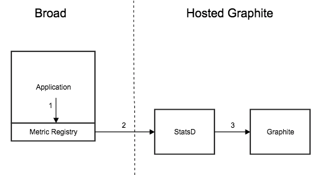

# Workbench Metrics

## High Level Data Flow



1. Application writes to Metric Registry
   - The Metric Registry is an in-memory registry for metric key/values provided by DropWizard Metrics. 
   - See Integrating for information on how to integrate this into Workbench code.
   - We use metrics-scala which is a Scala wrapper for DropWizard Metrics.
2. Metric Registry writes to StatsD
   - Note StatsD is hosted for us in Hosted Graphite as an add-on. 
   - We use metrics-statsd which pulls metrics off the registry and writes to StatsD using the standard UDP statsd protocol.
3. StatsD writes to Graphite
   - This is done within Hosted Graphite.
   - See this blog post for details about how the metrics are processed & stored within Hosted Graphite.
   
## Integrating

The code lives in workbench-utils here: https://github.com/broadinstitute/workbench-libs/tree/develop/metrics. See the README.md for instructions on how to start using it in your application.

## Metric Types
- DropWizard supports the following types of metrics (more detailed documentation with examples can be found in the metrics-scala manual):
   - Counter
      - Increments and decrements a 64-bit integer
   - Gauge
      - The simplest metric type - just returns a value
   - Histogram
      - Measures the distribution of values in a stream of data
   - Meter
      - Measures the rate at which a set of events occur
   - Timer
      - Basically a histogram of the duration of an event and a meter of the rate of its occurrence
- _Note_: these types exist only within the DropWizard metric registry. For each metric type, DropWizard does its calculation internally and sends everything to statsd gauge values. StatsD has a similar metric type hierarchy but we don't use it.

## Naming

Care must be given to metric naming so they are easily discoverable when creating Graphite dashboards. We have created some utility classes for generating metric names in a standardized, type-safe way. Basically you mix in this trait:
- WorkbenchInstrumented
and use ExpandedMetricBuilder to build counters, gauges, histograms, meters, or timers. For example:
```
val counter: Counter =
  ExpandedMetricBuilder
    .expand(WorkspaceMetric, workspaceName)
    .expand(SubmissionMetric, submissionId)
    .expand(WorkflowStatusMetric, status)
    .asCounter("count")
// generated counter has name:
// <baseName>.workspace.<workspaceNamespace>.<workspaceName>.submission.<submissionId>.workflowStatus.<workflowStatus>.count
// increments the counter:
counter += 1
```
This works because of the Expansion typeclass: for any type you pass into `ExpandedMetricBuilder`, it looks up an implicit `Expansion` instance which specifies how to generate a metric name fragment for that type. We currently have the following typeclass instances (feel free to add more if something is missing):
- `UUID` – simply calls `UUID#toString`
- `HttpMethod` – lower-case method name (e.g. get, post, put)
- `Uri` – dot-separated URI path (statsd doesn't allow slashes in metric names)
   - Note: you can override the URI expansion if desired in case custom filtering logic is needed. Rawls does this to redact some parts of the URI path to limit the number of metrics. See https://github.com/broadinstitute/rawls/blob/develop/core/src/main/scala/org/broadinstitute/dsde/rawls/metrics/InstrumentationDirectives.scala#L23-L24
- `StatusCode` – just the int value (200, 404, etc)
- `String` – useful when you don't have a more specific type
- Rawls defines some Rawls-specific ones as well

## Testing

### Unit Testing with ScalaTest
- Mix `StatsDTestUtil`s into your test class. Then you can verify the metric names & values being sent by the registry to StatsD like so:
```
it should "send metrics" in {
  withStatsD {
    // some code
  } { capturedMetrics =>
    // capturedMetrics is a List of (String, String) tuples representing the metric names and values sent to statsd
  }
}
```
- Real examples can be found in Rawls tests.

## Hosted Graphite
### Dashboards
- Grafana: https://www.hostedgraphite.com/e2dc6eb6/grafana/
   - Dashboards can be explored using the drop-down in the top left.
   - Dashboard definitions are stored as JSON, can can be altered programmatically if desired.
   - Grafana has a lot of features. Some docs including an interactive tour are here: https://www.hostedgraphite.com/docs/dashboards/grafana-dashboards.html
- Graphite: https://www.hostedgraphite.com/e2dc6eb6/graphite/composer/
   - A more primitive dashboarding tool, but useful for exploring metrics using a psuedo-directory structure.
   
   
